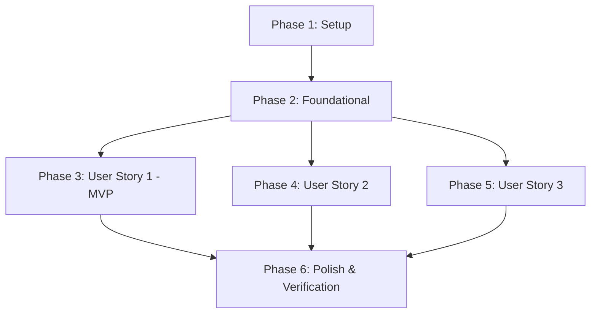

# 任务分解与执行清单：个人知识库文档编辑器前端组件

**功能分支**: `001-doc-editor-component` | **规范文件**: [spec.md](./spec.md) | **实施计划**: [plan.md](./plan.md)

本任务清单严格遵循依赖顺序与 User Story 优先划分原则，保证每个 Phase 可独立开发与独立测试验证。

---

## 阶段 1：项目初始化与基础设施 (Setup)

**目标**: 创建项目基础结构、依赖安装与 CSS 设计系统

- [x] T001 初始化 Vite + React + TypeScript 前端项目结构于 [../../frontend/](../../frontend) 目录
- [x] T002 安装 Tiptap 核心包 (`@tiptap/react`, `@tiptap/pm`, `@tiptap/starter-kit`, `tiptap-markdown`) 与工具库 (`@excalidraw/excalidraw`, `lucide-react`) 于 [../../frontend/package.json](../../frontend/package.json)
- [x] T003 [P] 创建并配置极简现代设计系统 CSS 样式于 [../../frontend/src/components/DocEditor/DocEditor.module.css](../../frontend/src/components/DocEditor/DocEditor.module.css)
- [x] T004 [P] 创建 8+ 高颜值预设主题配置文件于 [../../frontend/src/components/DocEditor/utils/defaultTheme.ts](../../frontend/src/components/DocEditor/utils/defaultTheme.ts)

---

## 阶段 2：地基与核心渲染基础设施 (Foundational)

**目标**: 创建 Tiptap Editor 核心封装与数据模型契约，此阶段阻塞后续所有 User Story

- [x] T005 定义 TypeScript 数据类型与 AST 接口于 [../../frontend/src/components/DocEditor/types.ts](../../frontend/src/components/DocEditor/types.ts)
- [x] T006 [P] 实现 Tiptap 编辑器基础 Hook 与主容器于 [../../frontend/src/components/DocEditor/index.tsx](../../frontend/src/components/DocEditor/index.tsx)
- [x] T007 [P] 实现编辑器命令式 Ref 控制接口 (`DocEditorRef`) 于 [../../frontend/src/components/DocEditor/index.tsx](../../frontend/src/components/DocEditor/index.tsx)

**检查点**: 基础 Tiptap 编辑器可渲染并输出空白文档。

---

## 阶段 3：User Story 1 - 基础文档编辑、斜杠菜单、气泡格式与拖拽重排 (Priority: P1) 🎯 MVP

**目标**: 交付基础文本排版（默认居左）、标题、列表、表格、斜杠菜单（`/`）、选区气泡工具栏（字号/调色盘/文本对齐控制）及左侧把手拖拽重排功能。

**独立测试方法**: 在编辑器中输入文字，使用 `/` 插入标题与表格，选中文本调整字号、前景色/高亮底色与文本对齐（左/中/右），悬浮左侧拖拽把手进行块上下换位。

### 自动化单元与集成测试 (User Story 1)

- [x] T008 [P] [US1] 编写斜杠菜单与格式工具栏交互测试于 [../../frontend/src/tests/DocEditor.test.tsx](../../frontend/src/tests/DocEditor.test.tsx)

### 功能实现 (User Story 1)

- [x] T009 [P] [US1] 实现自定义字号 Mark 扩展于 [../../frontend/src/components/DocEditor/extensions/FontSizeMark.ts](../../frontend/src/components/DocEditor/extensions/FontSizeMark.ts)
- [x] T010 [P] [US1] 实现斜杠菜单 (`/`) 快捷插入块组件于 [../../frontend/src/components/DocEditor/components/SlashMenu/index.tsx](../../frontend/src/components/DocEditor/components/SlashMenu/index.tsx)
- [x] T011 [P] [US1] 实现选中文本悬浮气泡工具栏组件（字号/加粗/颜色/高亮底色/文本对齐方式选择器）于 [../../frontend/src/components/DocEditor/components/BubbleToolbar/index.tsx](../../frontend/src/components/DocEditor/components/BubbleToolbar/index.tsx)
- [x] T012 [US1] 实现基于块左侧悬浮把手的拖拽重排 ProseMirror 插件于 [../../frontend/src/components/DocEditor/extensions/DragHandlePlugin.ts](../../frontend/src/components/DocEditor/extensions/DragHandlePlugin.ts)
- [x] T013 [US1] 实现拖拽指示线 UI 渲染于 [../../frontend/src/components/DocEditor/components/DragHandle/index.tsx](../../frontend/src/components/DocEditor/components/DragHandle/index.tsx)
- [x] T014 [US1] 集成表格扩展 (`@tiptap/extension-table`) 并定制极简卡片样式于 [../../frontend/src/components/DocEditor/index.tsx](../../frontend/src/components/DocEditor/index.tsx)

**检查点**: MVP 功能开发完毕，已具备基础文档与列表/表格编辑、格式工具栏及拖拽换位能力。

---

## 阶段 4：User Story 2 - 进阶块编辑（代码块、高亮嵌套容器与 Excalidraw 画图） (Priority: P2)

**目标**: 实现支持内嵌子块的 Callout 高亮容器（包含 Icon 选择器面板与 8+ 主题色板）、多语言代码块以及 Excalidraw 嵌入式画图块。

**独立测试方法**: 插入 Callout 块，在其框内插入代码块与表格，测试 Icon/Emoji 弹框选择与主题色板切换；插入 Excalidraw 块，绘制流程图并实时保存。

### 功能实现 (User Story 2)

- [x] T015 [P] [US2] 实现代码块语法高亮扩展于 [../../frontend/src/components/DocEditor/index.tsx](../../frontend/src/components/DocEditor/index.tsx)
- [x] T016 [US2] 实现 Callout 嵌套容器 Tiptap Node 扩展于 [../../frontend/src/components/DocEditor/extensions/CalloutExtension.ts](../../frontend/src/components/DocEditor/extensions/CalloutExtension.ts)
- [x] T017 [US2] 实现 Callout 容器 React NodeView 界面于 [../../frontend/src/components/DocEditor/components/Callout/CalloutView.tsx](../../frontend/src/components/DocEditor/components/Callout/CalloutView.tsx)
- [x] T018 [US2] 实现 Callout Icon/Emoji 弹出选择器与 8+ 主题色板组件于 [../../frontend/src/components/DocEditor/components/Callout/CalloutToolbar.tsx](../../frontend/src/components/DocEditor/components/Callout/CalloutToolbar.tsx)
- [x] T019 [US2] 实现 Excalidraw 画图 Tiptap Node 扩展于 [../../frontend/src/components/DocEditor/extensions/ExcalidrawExtension.ts](../../frontend/src/components/DocEditor/extensions/ExcalidrawExtension.ts)
- [x] T020 [US2] 实现 Excalidraw 嵌入式画布 React NodeView 组件于 [../../frontend/src/components/DocEditor/components/Excalidraw/ExcalidrawView.tsx](../../frontend/src/components/DocEditor/components/Excalidraw/ExcalidrawView.tsx)

**检查点**: 高亮嵌套容器与 Excalidraw 画图块独立运行正常。

---

## 阶段 5：User Story 3 - 文档导入导出与持久化 (Priority: P3)

**目标**: 实现 Block AST (JSON) 与 Markdown 文本的无损双向转换，保障持久化与导入导出。

**独立测试方法**: 导出文档得到 Markdown 文本与 JSON AST；清空编辑器后重新导入，验证所有节点与格式精准还原。

### 功能实现 (User Story 3)

- [x] T021 [P] [US3] 实现 Block AST JSON 转换与序列化模块于 [../../frontend/src/components/DocEditor/utils/serializer.ts](../../frontend/src/components/DocEditor/utils/serializer.ts)
- [x] T022 [P] [US3] 实现 Markdown 与包含 Excalidraw/Callout 的 AST 双向解析与导出模块于 [../../frontend/src/components/DocEditor/utils/serializer.ts](../../frontend/src/components/DocEditor/utils/serializer.ts)
- [x] T023 [US3] 编写 Markdown/AST 双向无损转换单元测试于 [../../frontend/src/tests/serializer.test.ts](../../frontend/src/tests/serializer.test.ts)

**检查点**: 复杂文档与数据在双向转换后无内容或格式丢失。

---

## 阶段 6：润色与整体验证 (Polish & Verification)

**目标**: 进行性能优化、视觉微调与端到端场景核查

- [x] T024 [P] 统一 CSS 变量名，优化深色/浅色模式及微交互视觉于 [../../frontend/src/components/DocEditor/DocEditor.module.css](../../frontend/src/components/DocEditor/DocEditor.module.css)
- [x] T025 按照 [quickstart.md](./quickstart.md) 手动验证 6 大核心场景并进行代码清理

---

## 依赖关系与执行顺序

### 实施策略

1. **MVP 优先 (User Story 1)**：完成 Phase 1 → Phase 2 → Phase 3，即完成一个具备极简排版、快捷菜单、格式工具栏与拖拽换位的基础编辑器 MVP。
2. **渐进交付**：在 MVP 基础上，顺序推进 Phase 4 (Callout 容器与 Excalidraw) 与 Phase 5 (AST/Markdown 双向持久化)。
