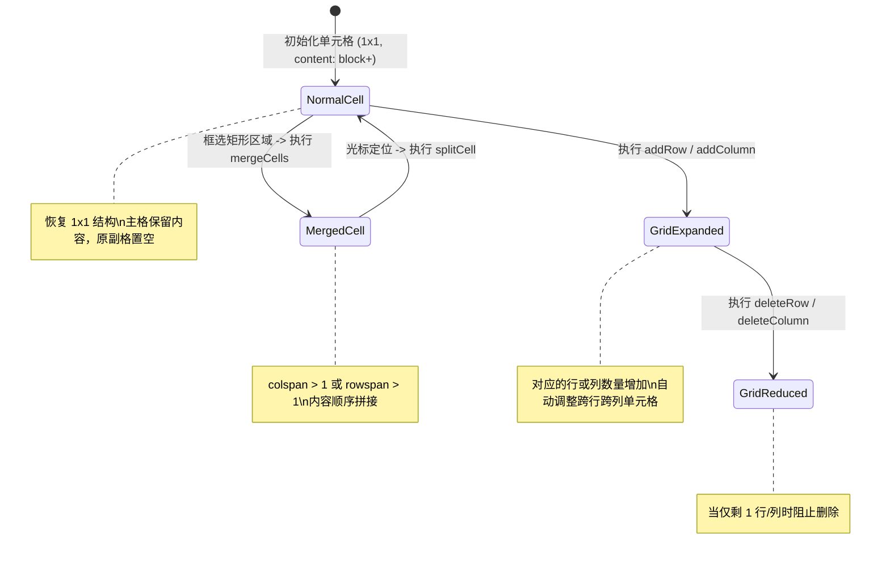

# Data Model: 表格 Block 增强与扩展功能

## 1. 实体定义 (Entities)

### 1.1 Table Node (表格块节点)
TipTap / ProseMirror Schema 节点类型: `table`

- **属性 (Attributes)**:
  - 无直接内联属性（由子节点驱动尺寸与列宽）。
- **包含内容 (Content)**: `tableRow+` (至少包含一个 `tableRow` 节点)
- **校验规则 (Validation)**:
  - 不能包含非 `tableRow` 类型的直接子节点。
  - 行数必须大于等于 1。

### 1.2 Table Row Node (表格行节点)
TipTap / ProseMirror Schema 节点类型: `tableRow`

- **属性 (Attributes)**:
  - 无直接属性。
- **包含内容 (Content)**: `(tableCell | tableHeader)+`
- **校验规则 (Validation)**:
  - 必须包含至少一个单元格节点。

### 1.3 Table Cell / Header Node (单元格节点)
TipTap / ProseMirror Schema 节点类型: `tableCell` / `tableHeader`

- **属性 (Attributes)**:
  - `colspan`: `number` (跨列数，默认 1)
  - `rowspan`: `number` (跨行数，默认 1)
  - `colwidth`: `number[] | null` (列宽度数组)
- **包含内容 (Content)**: `block+` (支持任意一个或多个块节点，如段落、标题、代码块、高亮块、列表等)
- **校验规则 (Validation)**:
  - `colspan` >= 1
  - `rowspan` >= 1
  - 内容非空（若内容清空会自动保底插入一个空白段落 `paragraph`）。

## 2. 状态转移模型 (State Transitions)



## 3. 前端交互状态类型 (UI State Types)

```typescript
export interface TableMenuState {
  /** 当前选区是否位于表格内部 */
  isInTable: boolean;
  /** 当前表格的总行数 */
  rowCount: number;
  /** 当前表格的总列数 */
  colCount: number;
  /** 是否可以执行合并单元格 */
  canMerge: boolean;
  /** 是否可以执行拆分单元格 */
  canSplit: boolean;
  /** 是否可以删除当前行（行数 > 1） */
  canDeleteRow: boolean;
  /** 是否可以删除当前列（列数 > 1） */
  canDeleteColumn: boolean;
}
```
