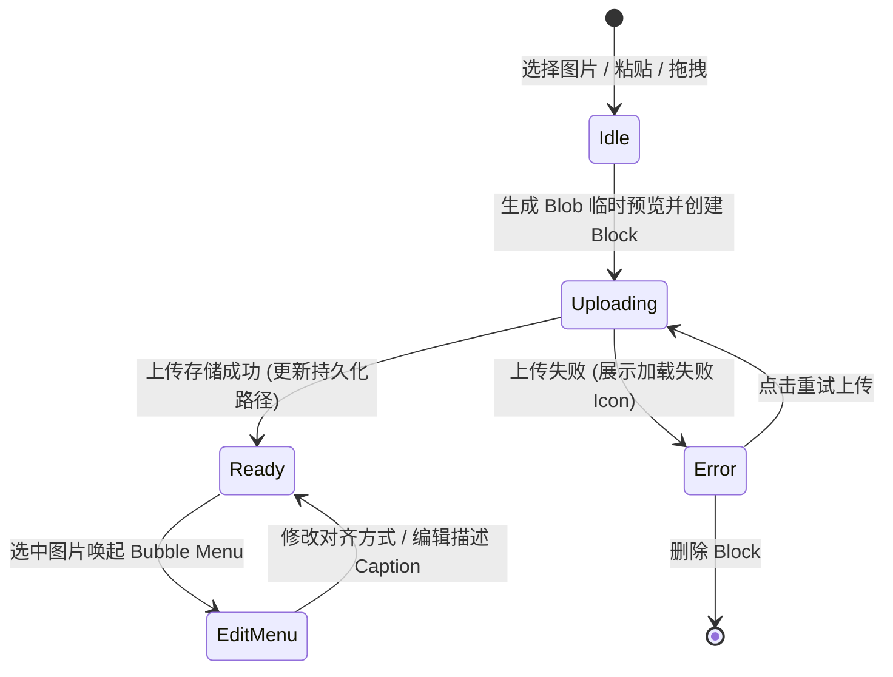

# Phase 1 Data Model: 图片 Block 数据结构与实体

## 实体定义 (Entities)

### 1. ImageBlockNode (图片 Block 节点实体)

定义在文档 JSON / HTML 结构中的块级节点。

| 属性名称 | 类型 | 必填 | 默认值 | 描述 |
|---|---|---|---|---|
| `id` | String | 是 | 自动生成 UUID | 图片 Block 的唯一标识符 |
| `src` | String | 是 | `""` | 图片访问地址（本地存储相对路径或网络 URL） |
| `blobSrc` | String | 否 | `null` | 乐观 UI 临时本地 Blob 预览地址 |
| `alt` | String | 否 | `""` | 图片替代文本/描述 |
| `caption` | String | 否 | `""` | 图片下方/菜单栏编辑的图片描述信息 |
| `width` | Number \| String | 否 | `"auto"` | 展示宽度 |
| `height` | Number \| String | 否 | `"auto"` | 展示高度 |
| `alignment` | `"left"` \| `"center"` \| `"right"` | 否 | `"center"` | 图片组件对齐方式（左对齐、居中对齐、右对齐） |
| `storageType` | `"local"` \| `"external"` | 是 | `"local"` | 存储模式：`local`（本地存储目录）/ `external`（网络外链） |
| `status` | `"uploading"` \| `"ready"` \| `"error"` | 是 | `"ready"` | 当前上传与加载状态 |
| `errorMessage` | String | 否 | `null` | 上传/加载失败时的提示信息 |

---

### 2. ImageBubbleMenu (气泡菜单实体/交互模型)

当图片 Block 处于选中状态时弹出的气泡工具栏。

| 控件名称 | 类型 | 功能说明 |
|---|---|---|
| `AlignmentGroup` | Button Group | 左对齐 (`left`) / 居中 (`center`) / 右对齐 (`right`) |
| `CaptionInput` | Text Input | 输入/编辑图片的描述或 Caption 说明文本 |
| `StorageModeToggle` | Button | 切换存储模式（转存本地 / 切换外链模式） |
| `ReplaceButton` | Button / Uploader | 重新选择本地图片或替换 URL |
| `DeleteButton` | Button | 移除当前图片 Block |

---

### 3. UploadTask (上传任务实体)

管理图片上传过程中的状态控制。

| 属性名称 | 类型 | 描述 |
|---|---|---|
| `taskId` | String | 任务唯一标识 |
| `file` | File \| Blob | 待上传的原始文件对象 |
| `previewUrl` | String | `URL.createObjectURL` 生成的本地临时预览路径 |
| `progress` | Number | 上传进度百分比 (0 - 100) |
| `status` | `"pending"` \| `"uploading"` \| `"success"` \| `"failed"` | 任务当前进度状态 |
| `resultUrl` | String | 存储目录返回的最终持久化访问路径 |
| `error` | String | 错误原因描述 |

---

### 4. StorageFile (存储目录文件实体)

存储于后台目标目录中的文件规范。

| 属性名称 | 类型 | 描述 |
|---|---|---|
| `filename` | String | 保持唯一性的存储文件名 (格式: `img_<timestamp>_<hash>.<ext>`) |
| `path` | String | 相对访问路径 (例如 `/uploads/img_20260814_1a2b3c.png`) |
| `mimeType` | String | 图片 MIME 类型 (`image/png`, `image/jpeg`, `image/webp`, `image/gif`) |
| `sizeBytes` | Number | 文件字节大小 |
| `createdAt` | ISO String | 文件创建时间戳 |

---

## 状态转换图 (State Transitions)

