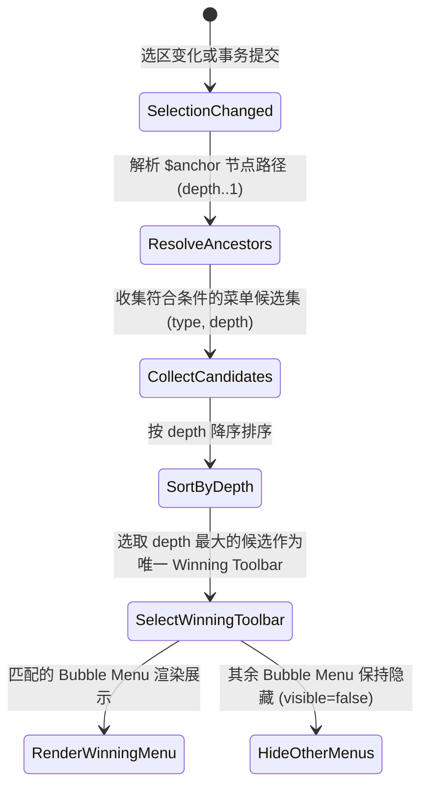
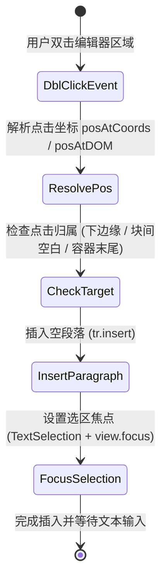

# Data Model & Interface Architecture: 内嵌 Block 交互优化与空白 Block 双击插入

**Feature Branch**: `008-nested-block-interaction`
**Date**: 2026-08-14
**Spec**: [spec.md](spec.md) | **Plan**: [plan.md](plan.md)

## 1. 核心类型定义

### 1.1 ToolbarType (菜单栏类型)

描述当前文档编辑器支持的浮动工具菜单栏标识。

```ts
export type ToolbarType = 'text' | 'table' | 'callout' | 'image' | null;
```

### 1.2 ActiveToolbarInfo (活动菜单信息)

描述经由层级调度计算得出的唯一活动菜单结果。

```ts
export interface ActiveToolbarInfo {
  /** 当前获胜并允许渲染的菜单类型 */
  type: ToolbarType;
  /** 获胜菜单在 ProseMirror 语法树中的嵌套深度 */
  depth: number;
}
```

---

## 2. 状态机与转换流程

### 2.1 菜单栏优先级计算状态转换



### 2.2 双击插入空白 Block 交互状态转换



---

## 3. 组件接口设计

### 3.1 DoubleTapInsertPlugin (双击插入插件)

用于扩展 TipTap 编辑器，响应 `dblclick` DOM 事件。

```ts
export const DoubleTapInsertPlugin = Extension.create({
  name: 'doubleTapInsert',
  addProseMirrorPlugins() {
    return [
      new Plugin({
        props: {
          handleDOMEvents: {
            dblclick: (view, event) => {
              // 判定与插入逻辑
            },
          },
        },
      }),
    ];
  },
});
```

### 3.2 getActiveToolbarInfo (菜单调度函数)

```ts
export function getActiveToolbarInfo(editor: Editor | null): ActiveToolbarInfo;
```
