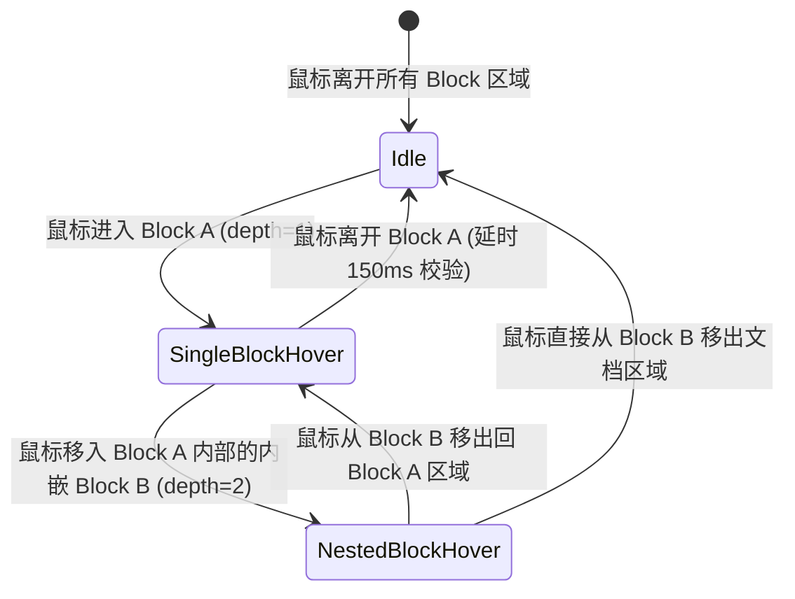

# 数据模型与状态定义：统一工具栏菜单管理

**Feature Branch**: `010-unified-toolbar-menu`
**Date**: 2026-08-14

## 实体与状态模型

### 1. HoverBlockTarget (悬停块目标)

代表当前被鼠标悬停的目标 Block 及其属性信息。

```typescript
export interface HoverBlockTarget {
  /** Block 唯一标识符或 DOM 节点引用标识 */
  id: string;
  
  /** 工具栏业务类型: 'table' | 'callout' | 'image' | 'codeBlock' | 'drawio' | 'default' */
  type: ToolbarType;
  
  /** 节点在语法树或 DOM 树中的嵌套深度 (最外层为 1，深层内嵌逐级递增) */
  depth: number;
  
  /** 挂载的目标 DOM 元素节点，用于定位浮动菜单 */
  domElement: HTMLElement;
  
  /** Block 绑定的 TipTap 节点位置 (pos) 或节点对象，用于执行插入/删除等通用操作 */
  nodePos?: number;
}
```

### 2. GlobalToolbarState (全局工具栏状态)

管理编辑器内当前的活动工具栏与悬停栈。

```typescript
export interface GlobalToolbarState {
  /** 当前处于激活显示状态的唯一悬停目标 (无悬停时为 null) */
  activeTarget: HoverBlockTarget | null;

  /** 当前鼠标指针处于其覆盖范围内的所有 Block 目标栈 (按 depth 升序排列) */
  hoverStack: HoverBlockTarget[];
}
```

### 3. ToolbarAction (工具栏操作元数据)

定义统一工具栏中操作按钮的数据结构。

```typescript
export interface ToolbarAction {
  /** 操作项唯一 Key */
  key: string;
  
  /** 图标或文本 Label */
  label: string;
  
  /** Tooltip 提示文本 */
  tooltip?: string;
  
  /** 点击执行回调 */
  onClick: (editor: Editor, target: HoverBlockTarget) => void;
  
  /** 是否为通用固定左侧按钮 (插入空白/删除) */
  isBuiltinLeft?: boolean;
}
```

## 状态转移规范



- **进入节点 (`mouseenter`)**: 将 target 压入 `hoverStack`，重新计算栈中 `depth` 最大的节点作为 `activeTarget`。
- **离开节点 (`mouseleave`)**: 启动 150ms 防抖判断（校验鼠标指针是否进入了工具栏菜单本身或其他子 Block），若确认离开则将 target 从 `hoverStack` 中移除，更新 `activeTarget` 为剩余最高 `depth` 节点或 `null`。
