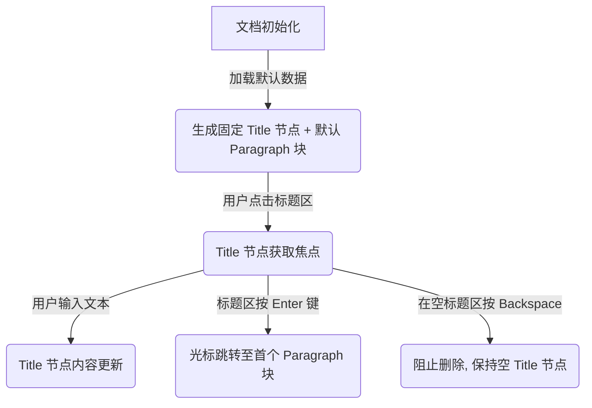

# 数据模型与 Schema 规范: DocEditor 内置 H1 文档标题

## 概述

本文档定义了 DocEditor 组件中内置 H1 标题节点（Title Node）的数据模型、Schema 节点结构以及状态变迁规则。

## 节点数据模型

### 1. Document (文档根节点)

- **Node Name**: `doc`
- **Content Spec**: `title block+`
- **说明**: 根节点严格限制内容必须包含且第一个节点必须为 `title`，后跟一个或多个 `block` 内容块。

### 2. Title (文档标题节点)

- **Node Name**: `title`
- **Group**: 无 (不属于通用 `block` 组，避免被拖拽或与其他块互换位置)
- **Content**: `inline*` (仅允许内联文本与 Mark)
- **Marks**: 允许基础 Mark (如文本格式)，忽略换行
- **Defining**: `true`
- **Selecting**: `false`
- **HTML DOM Target**: `<h1 class="doc-title-node" data-placeholder="...">...</h1>`

#### 属性结构 (Attributes)

| 属性名 | 类型 | 默认值 | 说明 |
| --- | --- | --- | --- |
| `level` | Number | `1` | 固定为 1，对应 HTML `<h1>` |
| `placeholder` | String | `'请输入文档标题'` | 当节点内容为空时的渲染提示文本 |

---

## 节点约束与校验规则

1. **不可删除性 (Non-deletable)**:
   - 无法通过键盘 Delete/Backspace 删除整个 `title` 节点。
   - 当节点内部文本清空后，节点依然保留在文档第 0 位置。

2. **不能被包裹/转换类型 (Non-transformable)**:
   - 无法将 `title` 节点转换为段落、引述、代码块、列表或低级标题。
   - `title` 节点不出现在块类型转换菜单（BlockTypeMenu）中。

3. **格式纯净化 (Paste Sanitization)**:
   - 粘贴到 `title` 节点的内容将被强制剥离换行符 `\n`，合并为单行文本。

---

## 状态变迁 (State Transitions)

